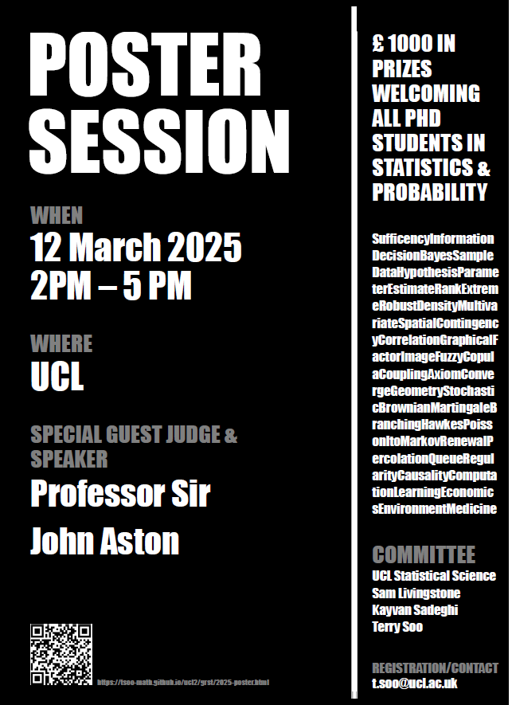

\pagenumbering{gobble}


```{r setup, include=FALSE}
knitr::opts_chunk$set(warning = FALSE, echo = TRUE)
```

```{r, echo=FALSE, results= 'hide', warning = FALSE}
library(latex2exp)
```




# Statistics & Probability 
## Poster session at UCL
### *Third edition*

* 12 March 2024. 2-5PM

*   3.30 - 5.00 PM, at [1-19 Torrington Place](https://www.ucl.ac.uk/maps/1-19-torrington-place),  UCL Stats Department (116,117,146)

* Guest Judge:  Professor Sir [John Aston](https://www.statslab.cam.ac.uk/~jada2/), Cambridge
  * [Bio](https://tsoo-math.github.io/ucl2/grst/2024JABiography.pdf)
  * [Photo](https://tsoo-math.github.io/ucl2/grst/JohnAston-pic.jpg)
  * Special [seminar](https://tsoo-math.github.io/ucl2/grst/aston-abstract.html) at 2 PM, B09 (1-19 Torrington Place).
  
* £ 1000 in prizes, we welcome posters from all universities 
  
*  Just show up with your printed poster, no size or template requirements


* committee:  UCL Statistical science, Sam Livingstone, Kayvan Sadeghi, Terry Soo
 * contact: t.soo@ucl.ac.uk


<hr>


* [Flyer](https://tsoo-math.github.io/ucl2/grst/flyer.pdf)

  * [QR code](https://tsoo-math.github.io/ucl2/grst/qr-code2025.png)

* [2023, 2nd edition](https://tsoo-math.github.io/ucl2/grst/2023-poster.html)

<hr>

*  Last updated: `r format(Sys.time(), '%d %B %Y')`


```{r, echo=FALSE, results='hide'}
dev.off()
```


