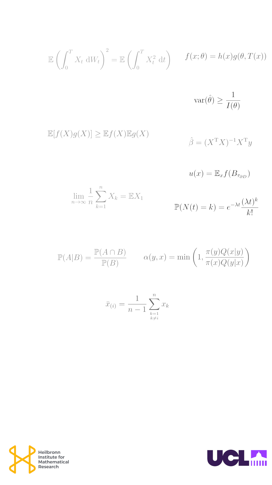

\pagenumbering{gobble}


```{r setup, include=FALSE}
knitr::opts_chunk$set(warning = FALSE, echo = TRUE)
```

```{r, echo=FALSE, results= 'hide', warning = FALSE}
library(latex2exp)
```




<hr>

<hr>

<hr>


# Statistics & Probability 
## Poster session at UCL
### *Fourth edition*

* 4 June 2026;  1-5PM

*   3.30 - 5.00 PM, at [1-19 Torrington Place](https://www.ucl.ac.uk/maps/1-19-torrington-place),  UCL [Department of Statistical Science](https://www.ucl.ac.uk/mathematical-physical-sciences/statistics) (116,117,146)

* Guest Judge:  Professor [Heather Battey](https://www.ma.imperial.ac.uk/~hbattey/), Imperial 
  * Special seminar at 2 PM, 115 (1-19 Torrington Place).
  
* £ 1000 in prizes, we welcome posters from all universities 
  * With partial support from the [Heilbronn Instiute](https://heilbronn.ac.uk/)
  
<hr>

* contact: [Terry Soo: t.soo@ucl.ac.uk](mailto: t.soo@ucl.ac.uk)


<hr>


* [Flyer](https://tsoo-math.github.io/ucl2/grst/poster2026.png)

  * [QR code](https://tsoo-math.github.io/ucl2/grst/qr-poster2026.png)

* [2025, 3rd edition](https://tsoo-math.github.io/ucl2/grst/2025-poster.html)

<hr>


<hr>

### Notes on equations


* [Sufficiency and Factorization](https://royalsocietypublishing.org/rsta/article/222/594-604/309/44085/On-the-mathematical-foundations-of-theoretical)

* [Harris' inequality](https://doi.org/10.1017%2FS0305004100034241)

* [Cramer-Rao lower bound](https://www.ias.ac.in/article/fulltext/reso/020/01/0076-0090)

* [Ordinary least squares](https://www.jstor.org/stable/2332682?origin=crossref&seq=1)

* [Solution to the Dirchlet problem vian Brownian motion](https://projecteuclid.org/journals/proceedings-of-the-japan-academy-series-a-mathematical-sciences/volume-20/issue-10/Two-dimensional-Brownian-motion-and-harmonic-functions/10.3792/pia/1195572706.full)

* [The Poisson distribution](https://www.sciencedirect.com/science/article/abs/pii/0167715282900104?via%3Dihub)


* [Conditional probability notation](https://www.bayesianspectacles.org/the-man-who-rewrote-conditional-probability/) 


* [Metropolis-Hastings](https://academic.oup.com/biomet/article-abstract/107/1/1/5686745?redirectedFrom=fulltext)

* [Jackknife](https://www.jstor.org/stable/2334280)

* [Law of large numbers](https://www.ams.org/journals/bull/2013-50-03/S0273-0979-2013-01411-3/)

* [Ito isometry](https://en.wikipedia.org/wiki/It%C3%B4_isometry)


<hr>

<hr>


*  Last updated: `r format(Sys.time(), '%d %B %Y')`


```{r, echo=FALSE, results='hide'}
dev.off()
```


